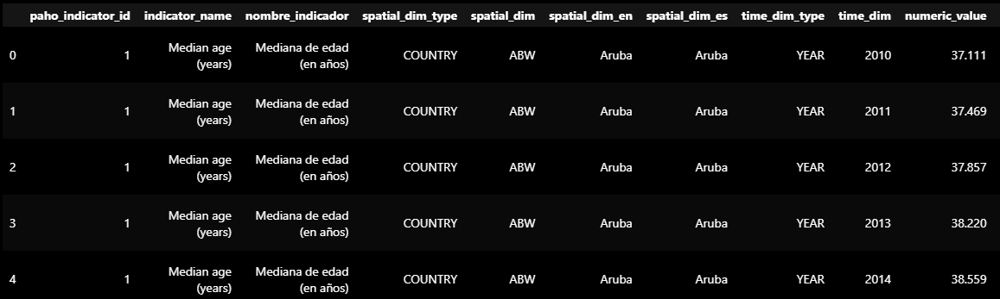
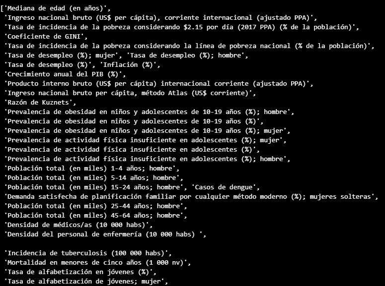
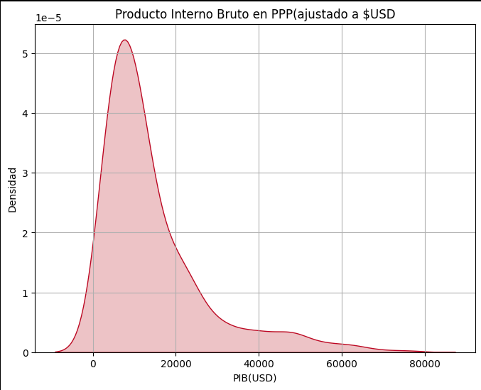
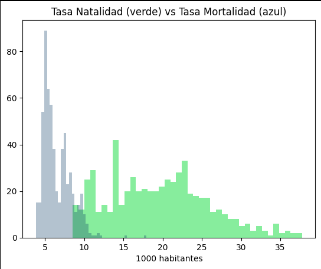
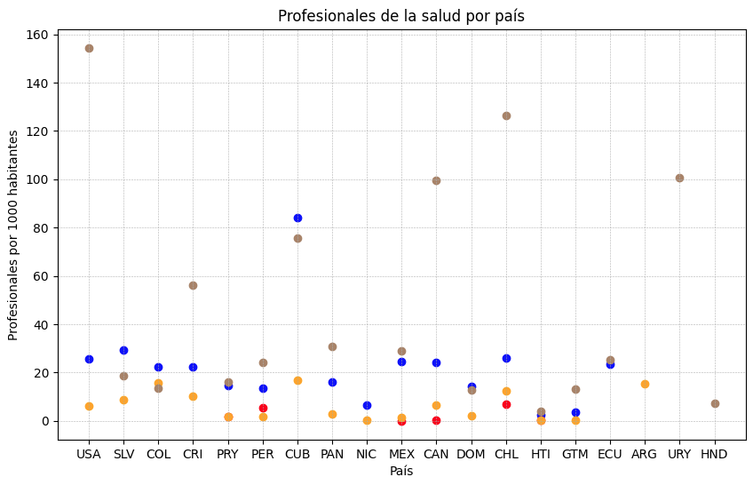
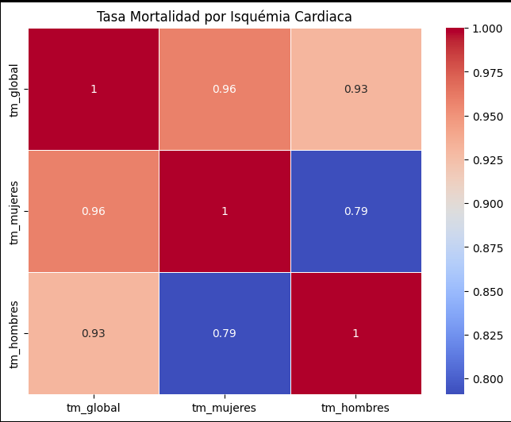
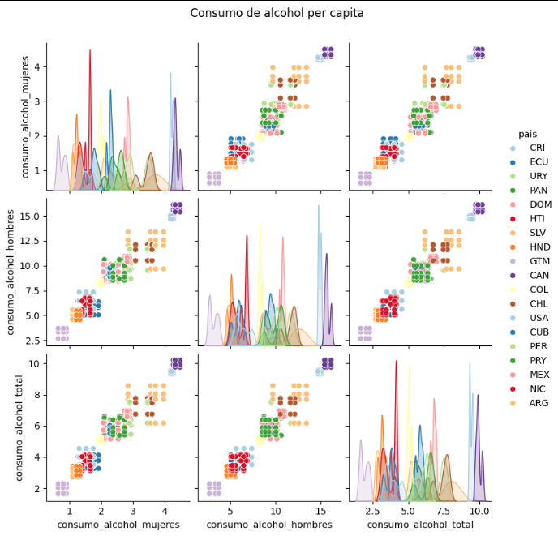
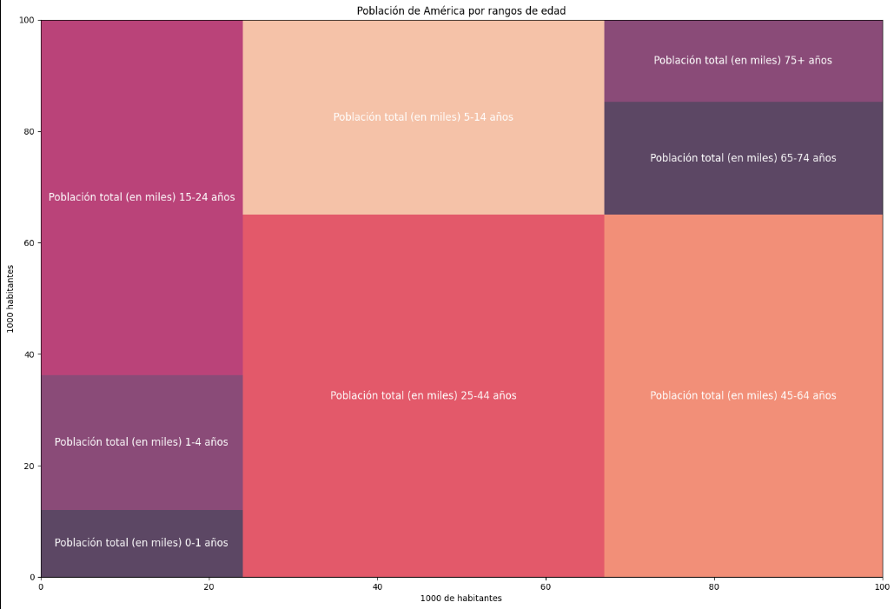
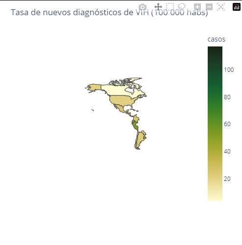

# Proyecto Modulo 3
# Indicadores Relacionados a la Salud en Paises de América

## Introducción

Los datos que se utilizan en este proyecto se descargaron de la página de PAHO.org, un portal interactivo que presenta mas de 140 indicadores de salud o relacionados a la salud desde 1995 a la fecha, los indicadores incluyen clasificaciones por edad, genero, si es urbano o rural. Nos brinda información escencial acerca de los indicadores de salud de los paises de América, con agrupamientos a nivel país, subregion o region

El dataset se puede encontrar en la siguiente liga: 

https://opendata.paho.org/en/core-indicators

## Preparación de los datos

El dataset consta de 27 columnas y cada fila contiene la información de diferentes indicadores con su respectiva medición.

Los indicadores con los que se cuenta y que se utilizaran para el análisis son:

Estos indicadores hacen referencia a las mediciones de una característica específica que refleja la salud de una población dada.

Se acotan los países que se analizarán ya que algunos de los paises reportados forman parte de otros (ej. Puerto Rico a Estados Unidos) 

## Análisis de la Información

#### Distribución del Producto Interno Bruto per Capita en $USD 

El Producto Interno Bruto (PIB) mide la producción total de bienes y servicios de uso final de un país
Su valor se utiliza para medir la riqueza y la estabilidad económica de su población residente durante un año

Se puede ver que la mayor distribución del PIB ronda en los 1,000 PPP (Purchasing Power Parity) ajustado a USD. 
Esto significa que, en este año, la producción económica y la paridad del poder adquisitivo estuvo mayormente cerca a los 1,000 dólares al año por cada uno de los habitantes de los países anaizados.

### Comparación de la distribución de las tasas de natalidad vs mortalidad

La tasa de natalidad es le número de nacimientos que se producen en un determinado país o área geográfica durante un período específico,dividido por la población total.

La tasa de mortalidad es el número total estimado de muertes por cualquier causa en la población de un determinado país o área geográfica, durante un año calendario específico, dividido por la población total.

La comparación muestra que en los paises analizados, en general, la tasa de mortalidad es mas baja que la de natalidad y también muestra que la tasa de natalidad está más distribuida en los paises que la tasa de mortalidad.

### Profesionales de la salud por país

La disponibilidad y el acceso a profesionales de la salud (médicos,dentistas,parteros) adecuadamente capacitados es clave para promover, mantener y recuperar la salud de una población. 
Con esta gráfica podemos identificar desigualdades en la distribución de los recursos sanitarios por país.

### Mapa de Calor para la Tasa de Mortalidad por Isquémia Cardiaca Global, Hombres y Mujeres

El color de cada celda representa la fuerza y ​​la dirección de la correlación; los colores más oscuros indican correlaciones más fuerte

### Relación entre el consumo de alcohol por país

El consumo total de alcohol per cápita (APC) se define como la cantidad total de alcohol consumido por persona entre adultos de 15 años o más durante un año calendario en un país determinado. Expresado en litros de alcohol puro.

El alcohol puede crear dependencia y es un importante factor de riesgo de enfermedades mentales, del comportamiento y no transmisibles, como la cirrosis hepática, algunos tipos de cáncer y enfermedades cardiovasculares, entre otras. También aumenta el riesgo de trauma y violencia. Más allá de las consecuencias para la salud, el consumo nocivo de alcohol tiene importantes repercusiones socioeconómicas en las personas y la sociedad en general.

# Población de América por rangos de edad

Estructura de edad de la población y la proporción de miembros potencialmente inactivos que se utiliza para estimar la tasa de dependencia.
Se utiliza para analizar la distribución geográfica lo que constituye información útil para planificar y evaluar políticas sanitarias y educativas.

# Tasa de casos nuevos detectados de VIH

El número de casos nuevos de personas diagnosticadas con el virus de la inmunodeficiencia humana (VIH), en un determinado país, territorio o área geográfica, durante un período específico.

Los afectados por el VIH tienen una alta susceptibilidad a otras enfermedades, como la tuberculosis y algunos tipos de cáncer. El VIH es una enfermedad prevenible pero no curable.

